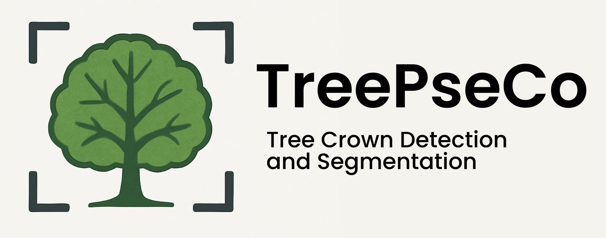
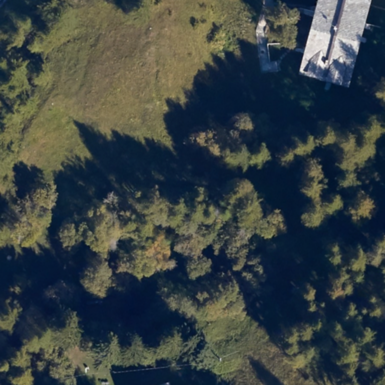
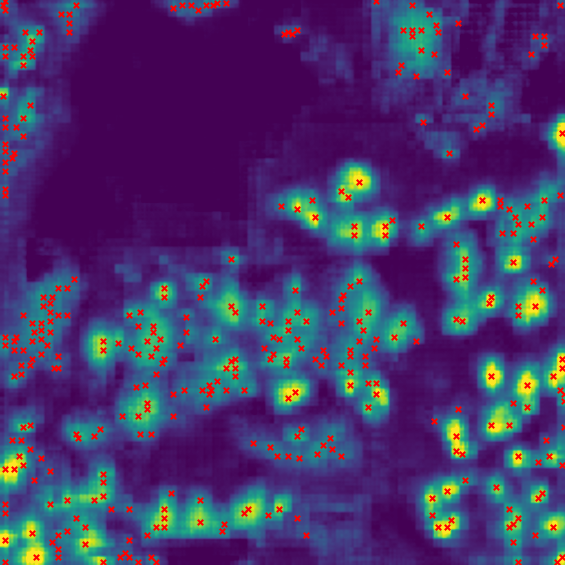
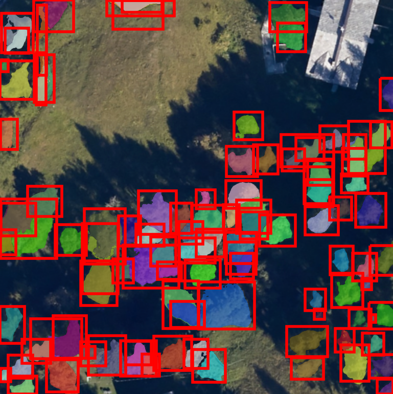

<div align="center">
  <h1></h1>
  <h3>TreePseCo: Scaling Individual Tree Crown Segmentation using Large Vision Models</h3>

  [Jacopo Lungo Vaschetti](mailto:jacopo.lungo@linksfoundation.com)<sup>1</sup>, [Edoardo Arnaudo](mailto:edoardo.arnaudo@linksfoundation.com)<sup>1</sup>, [Claudio Rossi](mailto:claudio.rossi@linksfoundation.com)<sup>1</sup>
  <br>
  <sup>1</sup> Fondazione LINKS, AI, Data & Space, Torino, Italy
  <br>

  [](https://isprs-archives.copernicus.org/articles/XLVIII-M-7-2025/275/2025/)
  [](https://opensource.org/licenses/MIT)

---

**Overview** | **Installation** | **Usage** | **Finetuning** | **Paper**
:---: | :---: | :---: | :---: | :---:
[Jump](#overview) | [Jump](#installation) | [Jump](#how-to-predict-with-treepseco) | [Jump](#how-to-finetune-treepseco-on-your-data) | [Jump](#citation)

</div>

---

## <a id="overview"></a> 🔭 Overview

TreePseCo is an adaptation of the [PseCo](https://github.com/Hzzone/PseCo) framework designed for automated individual tree crown segmentation in aerial imagery, leveraging foundation models like the [Segment Anything Model (SAM)](https://github.com/facebookresearch/segment-anything). Forest monitoring through tree crown delineation is crucial for sustainable management and carbon cycle assessment.

Our approach uses a three-stage pipeline:
1.  **Tree Center Detection:** A modified SAM decoder generates probability heatmaps to locate tree centers.
2.  **Instance Mask Generation:** Prompt-guided segmentation using SAM's visual features produces masks based on detected centers.
3.  **Boxes Selection and Refinement:** A modified Faster R-CNN refines boxes' boundaries and eliminates false positives.

TreePseCo demonstrates strong generalization capabilities, particularly in new geographical contexts and dense or complex forest environments.

<p align="center">
  
  
  
  <br>
  <i>Fig: Original Image, Heatmap/Points, Output Masks/Boxes</i>
</p>

---

## <a id="installation"></a> ⚙️ Installation

1.  **Create Environment:** Set up a virtual environment using Python 3.10 or higher.
    ```bash
    python3 -m venv .venv
    source .venv/bin/activate
    ```

2.  **Install Dependencies:**
    ```bash
    pip install -r requirements.txt
    ```

3.  **Download SAM Weights:** Download the pretrained weights for the Segment Anything Model.
    ```bash
    mkdir -p ./pretrained/SAM
    wget -P ./pretrained/SAM https://dl.fbaipublicfiles.com/segment_anything/sam_vit_h_4b8939.pth
    ```

---

## <a id="how-to-predict-with-treepseco"></a> 🚀 Inference

1.  **Download TreePseCo Weights:** Download the pretrained weights for the point decoder and the classification head (FRCNN).

    1.1  **Point Decoder Weights**
    ```bash
    wget -P ./pretrained/point_decoder https://github.com/links-ads/earsel25-treepseco/releases/download/v1.0/point_decoder.zip
    unzip ./pretrained/point_decoder.zip -d ./pretrained && rm ./pretrained/point_decoder.zip
    ```

    <!-- This zip file contains the following Point Decoder weights:
    * `pt_dec_neon_pretrain_loss_04006.pth`: Pretrained on NEON.
    * `pt_dec_neonTree_finetuned_loss_01950.pth` and `pt_dec_neonTree_finetuned_perf_mAP_19000.pth`: Finetuned on the NeonTree dataset.
    * `pt_dec_vda_finetuned_loss_46837.pth`: Finetuned on the VdA dataset.  -->
    
    1.2  **FRCNN Weights:**
    ```bash
    wget -P ./pretrained/frcnn https://github.com/links-ads/earsel25-treepseco/releases/download/v1.0/frcnn.zip
    unzip ./pretrained/frcnn.zip -d ./pretrained && rm ./pretrained/frcnn.zip
    ```
    <!-- This zip file contains the following FRCNN weights:
    * `frcnn_neonTree_mAP_15434.pth`: Trained on the NeonTree dataset.
    * `frcnn_vda_mAP_14758.pth`: Trained on the VdA dataset. -->

2.  **Prepare Images:** Place the images you want to process into the `data/predict_images` folder.

3.  **Run Prediction:** Execute the prediction script, providing paths to the downloaded weights.
    ```bash
    python 3_predict_TreePseco.py model.point_decoder.state_dict=<PATH_TO_PT_DEC_WEIGHTS>.pth model.frcnn.state_dict=<PATH_TO_FRCNN_WEIGHTS>.pth
    ```
    *Important: Escape any `=` sign within the path arguments by prepending `\\` (e.g., `"model.frcnn.state_dict=frcnn_val_mAP\=0.14682.pt"`).*

4.  **View Results:** Prediction outputs can be visualized using Tensorboard. Launch it using:
    ```bash
    tensorboard --logdir=outputs/treePseco
    ```

---

## <a id="how-to-finetune-treepseco-on-your-data"> </a>✨ Finetune on Your Data

Finetuning involves preparing your dataset, finetuning the point decoder, and finetuning the classification head.

### 1. Prepare Your Dataset

* **Format:** You need a dataset with bounding box labels in COCO format.
* **Location:** Place your dataset in a folder like `data/<YOUR_DATASET_NAME>`.
* **Configuration:** Create a dataset configuration file `configs/data/<YOUR_DATASET_NAME>.yaml`. Specify the following variables:

    ```yaml
    dataset_name: <YOUR_DATASET_NAME> # e.g., my_forest_data
    train_img_dir: ./data/<YOUR_DATASET_NAME>/train/images # Path to training images
    train_ann_file: ./data/<YOUR_DATASET_NAME>/train/annotations.json # Path to training annotations
    val_img_dir: ./data/<YOUR_DATASET_NAME>/val/images # Path to validation images
    val_ann_file: ./data/<YOUR_DATASET_NAME>/val/annotations.json # Path to validation annotations
    augment: false # Set to true to enable augmentation
    ```
    *Example:*
    ```yaml
    dataset_name: neon_tree
    train_img_dir: ./data/neon_tree/training_converted/images
    train_ann_file: ./data/neon_tree/training_converted/annotations.json
    val_img_dir: ./data/neon_tree/evaluation/images
    val_ann_file: ./data/neon_tree/evaluation/annotations.json
    augment: false
    ```

### 2. Point Decoder Finetuning

* **Configuration:** Training parameters (batch size, learning rate, validation frequency, images to log) can be adjusted in the training config file `configs/train_point_decoder_supervised_finetune.yaml` or modified via command line.
* **Start Training:** Run the finetuning script for the point decoder, specifying your dataset name.
    ```bash
    python 1_train_point_decoder_supervised_finetuning.py data=<YOUR_DATASET_NAME>
    ```
* **Monitoring:** Monitor the training progress using Tensorboard.
    ```bash
    tensorboard --logdir outputs/pt_dec_finetune
    ```
* **Outputs:** Logs, checkpoints, and the model state dictionary will be saved in `outputs/pt_dec_finetune`.
* **Note on mAP:** The training monitors a theoretical maximum mAP using an oracle classification head. This metric is influenced by both the point decoder quality and the `heatmap_box_detector` parameters used during peak extraction.

### 3. Classification Head (FRCNN) Finetuning

This stage trains a modified Faster R-CNN without its own Region Proposal Network, using proposals derived from SAM masks instead.

* **Step 0: Download Backbone:** Download the DeepForest RN50 backbone.
    ```bash
    mkdir -p ./pretrained/rn50
    wget https://huggingface.co/weecology/deepforest-tree/resolve/main/NEON.pt?download=true -O ./pretrained/rn50/NEON.pt
    ```

* **Step 1: Cache Proposals:** Generate and cache bounding box proposals using the finetuned point decoder. Assign a unique name for this cache.
    ```bash
    python 2_1_gen_boxes_from_point_decoder.py unique_out_name=<UNIQUE_CACHE_NAME> model.point_decoder.point_decoder_state_dict_path=<PATH_TO_FINETUNED_PT_DEC>.pth data=<YOUR_DATASET_NAME>
    ```
    *Important: Remember to escape any `=` signs in paths with `\`, like `=\`.*
    *Proposals will be saved in `outputs/cached_proposals/<UNIQUE_CACHE_NAME>`.*

* **Step 2: Train Classification Head:** Train the FRCNN head using the cached proposals.
    ```bash
    python 2_2_train_cls_head.py training.proposals_unique_out_name=<UNIQUE_CACHE_NAME> data=<YOUR_DATASET_NAME>
    ```
* **Outputs:** Logs, checkpoints, and the model state dictionary will be saved in `outputs/frcnn/`.

You can now use the finetuned weights (**point decoder** and **FRCNN**) by following the prediction instructions in the [Usage section](#how-to-predict-with-treepseco).

---

## 🤝 Acknowledgements

This work builds upon and benefited greatly from the following open-source projects:

* **[DeepForest](https://github.com/weecology/DeepForest)**
* **[PseCo](https://github.com/Hzzone/PseCo)**
* **[Segment Anything Model (SAM)](https://github.com/facebookresearch/segment-anything)**

We thank the original authors and maintainers for their valuable contributions to the community.

---

## <a id="citation"></a> ✏️ Citation

If you find this work useful in your research, please consider citing:

```bibtex
@Article{isprs-archives-XLVIII-M-7-2025-275-2025,
AUTHOR = {Lungo Vaschetti, J. and Arnaudo, E. and Rossi, C.},
TITLE = {TreePseCo: Scaling Individual Tree Crown Segmentation using Large Vision Models},
JOURNAL = {The International Archives of the Photogrammetry, Remote Sensing and Spatial Information Sciences},
VOLUME = {XLVIII-M-7-2025},
YEAR = {2025},
PAGES = {275--282},
URL = {https://isprs-archives.copernicus.org/articles/XLVIII-M-7-2025/275/2025/},
DOI = {10.5194/isprs-archives-XLVIII-M-7-2025-275-2025}
}
